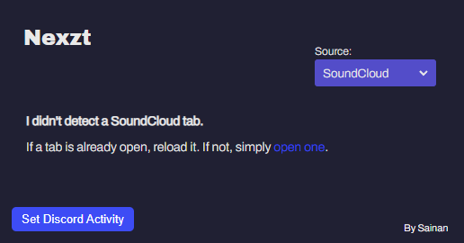

<b><h1 align="center">Nexzt</h1></b>

# Since [Premid](https://premid.app/) Now supports Watching, Playing, Listening, this extension is kinda unnecessary.

THIS IS A PERSONAL FORK FROM [SET DISCORD ACTIVITY](https://github.com/Sainan/Set-Discord-Activity) TO IMPROVE THE UI AND PRACTICE JS & CSS.

**EN:** Set "Playing", "Streaming", "Listening to" &"Watching" in Discord to whatever you want **(And without using the Discord Desktop App!)**.

**ES:** Establece "Jugando", "Transmitiendo", "Escuchando" & "Viendo" en Discord a lo que quieras **(Y sin la aplicación de escritorio de Discord!)**.

## TODO

- [ ] Migrate from Manifest V2 to Manifest V3 using service workers.
- [ ] Add a "Dark Mode" option?
- [ ] Add a "Light Mode" option too?
- [ ] Use the "Box model" for CSS i guess.
- [ ] Create a size for selecting the type of custom rich presence.

## Screenshots

## How to try this fork

**This extension only works on a chromium based browser.** Such as:  [Edge](https://www.microsoft.com/edge),  [Chrome](https://www.google.com/chrome/),  [Brave](https://brave.com),  [Opera](https://www.opera.com), etc...

### Download the source code and extract it wherever you want

### Or...

    git clone https://github.com/DznDani/Nexzt

### And to install it on your browser, you have to enable "Developer Mode" in the extensions menu.

### Then, load the folder extension with:

### And you're done!
